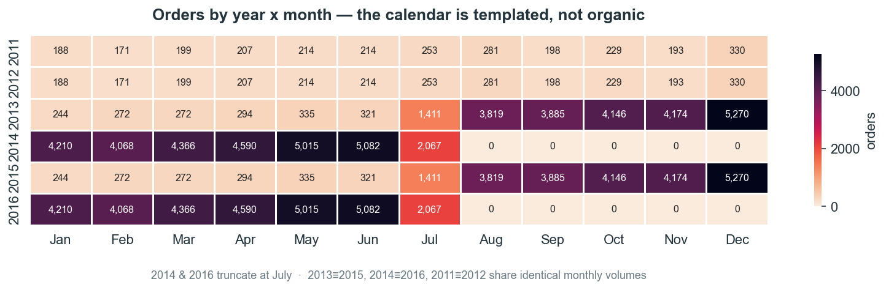
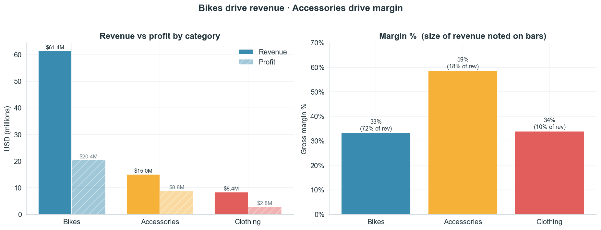
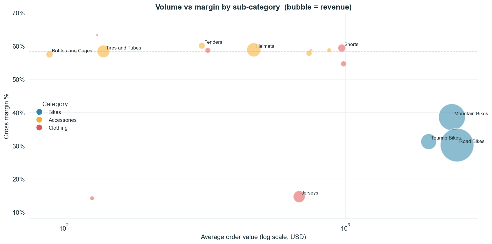
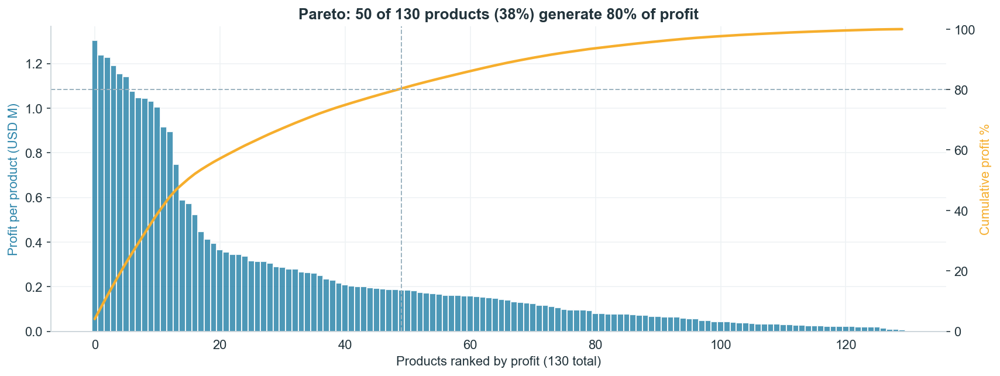
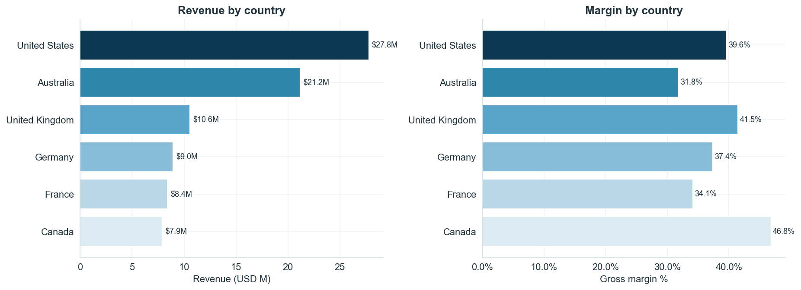
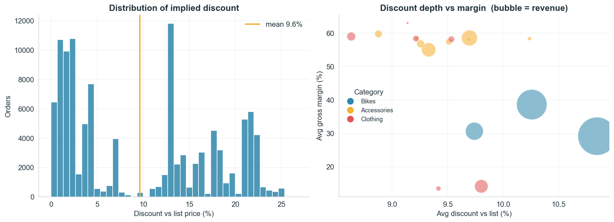
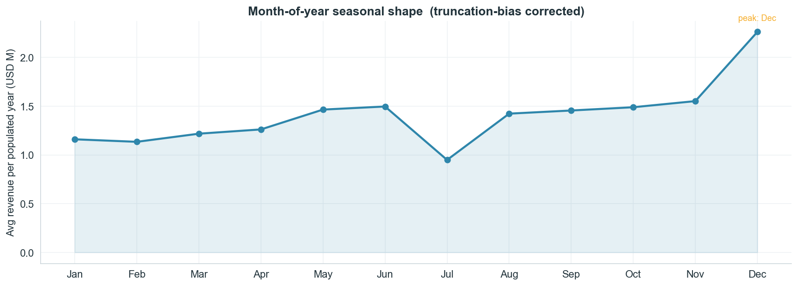

# 🚲 Global Bike Retailer — Profitability & Customer Analytics

[](https://bike-store-sales-2iknvtygxykutdufslmnsr.streamlit.app/)

**▶️ Live dashboard:** https://bike-store-sales-2iknvtygxykutdufslmnsr.streamlit.app/

End-to-end analytics on **113,036 sales transactions** for a multinational bike
retailer (Bikes · Accessories · Clothing across 6 countries). The project pairs a
fully-reproducible **Jupyter notebook** with an interactive **Streamlit dashboard**,
both driven by a single data pipeline so every number is identical across deliverables.

> **The one-line story:** *Revenue and profit don't come from the same place.*
> **Bikes** generate ~72% of revenue at a ~33% margin, while **Accessories** sell for a
> fraction of the ticket but at a ~59% margin. The strategic lever isn't "sell more
> bikes" — it's **attach-rate / cross-sell**.

---

## 📌 Headline numbers (full, cleaned dataset)

| Metric | Value |
|---|---:|
| Revenue | **$84.83M** |
| Profit | **$32.05M** |
| Gross margin | **37.8%** |
| Orders | **112,036** |
| Units sold | **1,333,705** |
| Avg order value | **$757** |
| Avg discount vs list | **9.6%** |
| Markets · products | **6 countries · 130 products** |

---

## 🧭 What makes this analysis different: a data-integrity audit *first*

Most analyses of this popular Kaggle dataset quietly report **year-over-year growth**.
That growth is **fabricated by the data itself** — and this project proves it before
drawing a single business conclusion.



A forensic audit of the raw file shows the calendar is **templated, not organic**:

- **2014 and 2016 stop in July** — the entire second half of those years is empty.
- Monthly order-count vectors are **byte-identical** for `2013 ≡ 2015`, `2014 ≡ 2016`
  and `2011 ≡ 2012`. Real businesses don't reproduce identical monthly volumes two
  years apart.

**Decision:** the data is analysed as a **cross-section** ("book of business"), and
time is studied only as a **pooled, truncation-corrected month-of-year shape** — never
as a trend. *Good analysis is as much about what you refuse to claim as what you show.*

The money columns, by contrast, are trustworthy: `Revenue = Cost + Profit` and
`Cost = Unit_Cost × Quantity` hold for **100%** of rows.

---

## 🔑 Key findings

### 1 · Bikes drive revenue, Accessories drive margin



Accessories deliver a **~59% margin** versus **~33%** on Bikes. Because accessories
ride on the same customer visit as a bike, the highest-ROI lever is **attach-rate**
(helmets, tires/tubes, bottles & cages, racks at the point of bike sale).

### 2 · The volume-vs-margin trade-off is structural



Each bubble is a sub-category. The two engines sit in **opposite corners**:
high-ticket / low-margin Bikes (bottom-right) vs low-ticket / high-margin Accessories
(top-left). This is the map a category manager should plan assortment against.

### 3 · Profit is concentrated (Pareto)



**~38% of products generate 80% of profit** — concentrate depth and inventory
availability on the proven core before chasing the long tail.

### 4 · Geography hides a margin gap



The **United States + Australia** account for ~58% of revenue, but they're the
**lower-margin** markets (Australia 31.8%). **Canada (46.8%)** and the **UK (41.5%)**
are smaller but richer. Defend volume in the big markets while deliberately growing
the high-margin ones.

### 5 · Discounting lands hardest on the lowest-margin products



Booked revenue sits on average **9.6% below list**. The deepest discounts fall on the
**lowest-margin Bikes** — a clear case for floor-margins on big-ticket items.

### 6 · A defensible seasonal shape (with caveats)



Averaging each month across only the years it's populated removes the truncation bias
and recovers a plausible **Q4 holiday lift**. The July dip is flagged as a templating
artifact — the curve is indicative, not precise.

---

## 🖥️ Interactive dashboard

A 6-tab Streamlit app (Profitability · Customers · Geography · Pricing & Discount ·
Seasonality · Data Quality) with live filters on country, category, gender and age group.

**🔗 Try it live:** https://bike-store-sales-2iknvtygxykutdufslmnsr.streamlit.app/

Or run it locally:

```bash
pip install -r requirements.txt
streamlit run app/app.py
```

---

## 📂 Project structure

```
bike-store-sales/
├── sales_data.csv                  # raw Kaggle data (as downloaded)
├── src/
│   ├── data_prep.py                # single source of truth: clean + features + KPIs
│   └── viz.py                      # shared palette & number formatters
├── notebooks/
│   └── bike_store_analysis.ipynb   # full analysis, pre-executed (renders on GitHub)
├── app/
│   └── app.py                      # interactive Streamlit dashboard
├── reports/figures/                # exported charts (used in this README)
├── data/sales_clean.csv            # generated by the pipeline (git-ignored)
├── requirements.txt
└── README.md
```

---

## 🔁 Reproducibility

Every figure and KPI in the notebook, the app and this README is computed from
**`src/data_prep.py`** — there are no hard-coded numbers, so the deliverables can't
drift apart.

```bash
# regenerate the cleaned dataset + print the audit and KPIs
python src/data_prep.py

# re-execute the notebook end-to-end
jupyter nbconvert --to notebook --execute --inplace notebooks/bike_store_analysis.ipynb
```

---

## ⚠️ Limitations

- **No customer / order id** → behavioural analytics (RFM, CLV, retention, cohorts,
  market-basket) are not possible; demographics are at the *transaction* level.
- **Templated, partially-truncated calendar** → no year-over-year trend claims.
- `Unit_Price` is a **list price**; the "discount" is the modelled gap between list and
  booked revenue, not a recorded promo code.
- The dataset is a **synthetic / educational** extract (AdventureWorks lineage);
  findings demonstrate analytical method, not real trading results.

---

## 🛠️ Tech stack

`Python` · `pandas` · `numpy` · `matplotlib` · `seaborn` · `plotly` · `streamlit` · `Jupyter`

**Data source:** [Sales Data — Kaggle](https://www.kaggle.com/datasets/serhatabuk/sales-data-csv)

---

## 📄 License

Released under the [MIT License](LICENSE).
